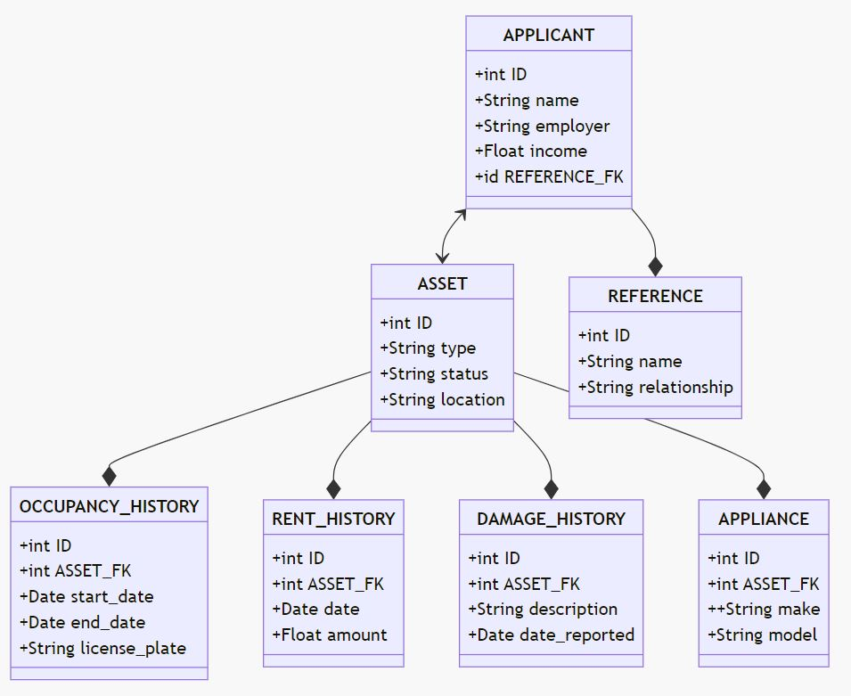

# COMP7071 CRM API

## Description

API For CRM implemented using MongoDB but modelled after the relational diagram below.

Swagger (with SwaggerUI) and OpenAPI are used in this project for quick development and ease of testing.

The API allows CRUD operations directly on `applicant` and `asset` as well as their nested structures (`reference`, `occupancy_history`, `rent_history`, `damage_history`, `appliances`)

## Prerequisites

Ensure you have Docker and Docker Compose installed on your system. For installation instructions refer: 
- [Install Docker](https://docs.docker.com/get-docker/)
- [Install Docker Compose](https://docs.docker.com/compose/install/)

## Setup & Run

### Docker Compose

This deploys the API and MongoDB to containers on your host

1. Unzip this project and navigate to it in a terminal
1. Build and run the project with Docker Compose: `docker-compose up -d --build`

The port forwarding to the host can be configured under the `app` service in the Docker Compose file

### Manual

1. Unzip this project and navigate to it in a terminal
1. Create a Python virtual environment: `python3 -m venv .venv`
1. Activate the virtual environment
    1. Linux: `source ./.venv/bin/activate`
    1. Windows: `.\.venv\Scripts\Activate.ps`
1. Install the Python requirements: `pip install -r ./crm-api/requirements.txt`
1. Change directory to `crm-api`
1. Run the project: `python3 .\app.py`

The port the API listens on can be configured under the `app` section in `crm-api\app_conf.yml`

## Usage

You make requests using your preferred method such as Postman or Curl, however the project deploys SwaggerUI which is the easiest.

### SwaggerUI

Once the app is running, navigate to [http://localhost:8100/ui](http://localhost:8100/ui) to access the SwaggerUI

### Postman

Follow these instructions to import the OpenAPI spec into Postman [Import Swagger APIs](https://learning.postman.com/docs/getting-started/importing-and-exporting/importing-from-swagger/)

## Stopping the Project

To stop the running services: `docker-compose down`

Or if you ran manually, ctrl+z in the terminal running the API
